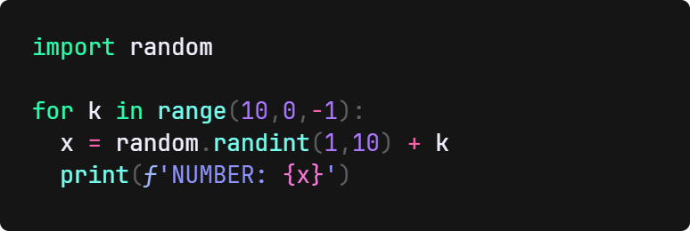
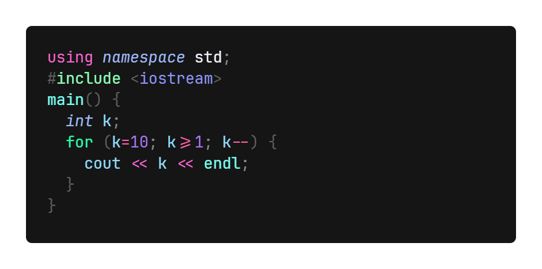
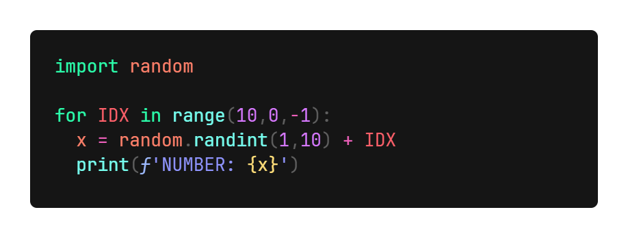
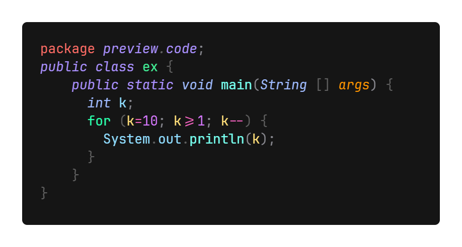
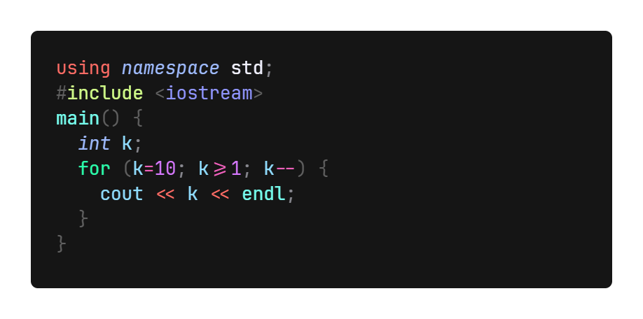

<style>
faded { color:#80808090}
red { color:#FF806A }
orange { color:#FF9025 }
yellow { color:#FFDE65 }
olive { color:#D2FF8A }
green { color:#8AFFB5 }
cyan { color:#77FFEF }
blue { color:#8085FF }
pink { color:#FF80CC }
red-- { color:#FF4D9A }
orange-- { color:#FF65D3 }
yellow-- { color:#E565FF }
olive-- { color:#9AFFB0 }
green-- { color:#2BFFAB }
cyan-- { color:#55FFEF }
blue-- { color:#7075FF }
pink-- { color:#FC61D0 }
</style>

# <blue><b>XulbuX</b></blue> <cyan>Neon</cyan> <green-->Pro</green->

## A THEME WHICH FOCUSES ON <pink>CLEAR & BEAUTIFUL COLORS</pink>

This VisualStudioCode extension contains two themes, which both try to make VSCode look good and do very clear syntax highlighting.

> To get a better feeling of how the themes look on the code, continue at the THEME PREVIEWS.

**Apply one of the themes:**

* Open the command input (`Cmd+Shift+K` on macOS or `Ctrl+Shift+K` on Windows and Linux or `F1` on all three).
* Enter "color theme" in the input field and click on `Preferences: Color Theme`.
* Search for the themes and select one of them: `XulbuX Neon` or `XulbuX Neon Pro` by clicking on it.

<br>

# COLORS

*<faded>If you can't see the colored text, it's likely because VisualStudioCode doesn't show the colors.</faded>*<br>
*<faded>In this case, just look at the example code-snippets to see how the themes look.</faded>*

|         XulbuX Neon         |     XulbuX Neon Pro     |
|            :--:             |          :--:           |
|     <red-->red</red->       |     <red>red</red>      |
| <orange-->orange</orange--> | <orange>orange</orange> |
| <yellow-->yellow</yellow--> | <yellow>yellow</yellow> |
|  <olive-->olive</olive-->   |  <olive>olive</olive>   |
|  <green-->green</green-->   |  <green>green</green>   |
|    <cyan-->cyan</cyan-->    |    <cyan>cyan</cyan>    |
|    <blue-->blue</blue-->    |    <blue>blue</blue>    |
|    <pink-->pink</pink-->    |    <pink>pink</pink>    |

<br>

# THEME PREVIEWS

### <blue><b>XulbuX Neon</b>:</blue>

> **PYTHON**

</img><br>

> **JAVA**

</img><br>

> **C++**

</img><br><br>


### <blue><b>XulbuX Neon Pro</b>:</blue>

> **PYTHON**

</img><br>

> **JAVA**

</img><br>

> **C++**

</img><br>

<br>
<br>

---
# <orange><b>Enjoy!</b></orange>

<br>

## <blue>Code Used for Color Previews

**PYTHON**
```python
import random

for k in range(10,0,-1):
  x = random.randint(1,10) + k
  print(f'NUMBER: {x}')
```
<br>

**JAVA**

```java
package preview.code;
public class ex {
    public static void main(String [] args) {
      int k;
      for (k=10; k>=1; k--) {
        System.out.println(k);
      }
    }
}
```
<br>

**C++**

```cpp
using namespace std;
#include <iostream>
main() {
  int k;
  for (k=10; k>=1; k--) {
    cout << k << endl;
  }
}
```
