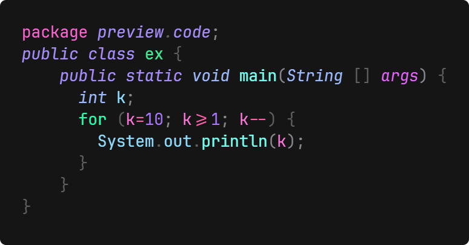
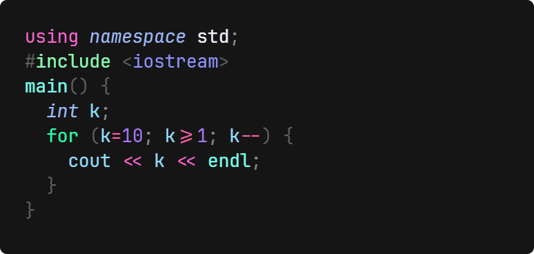
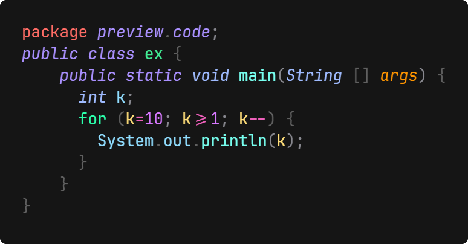
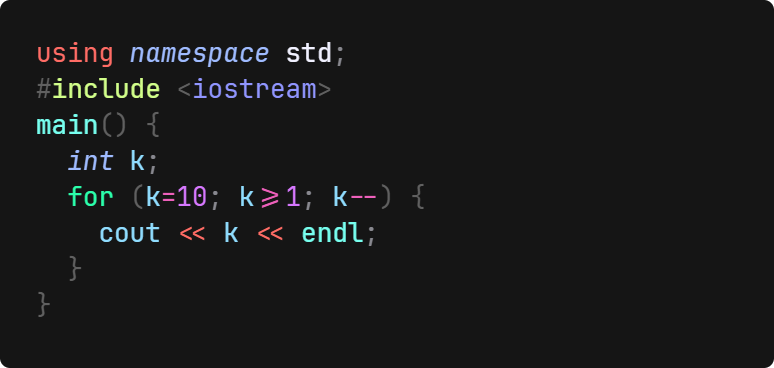

# XulbuX Neon Pro

## A THEME WHICH FOCUSES ON CLEAR & BEAUTIFUL COLORS

This VisualStudioCode extension contains two themes, which both try to make VSCode look good and do very clear syntax highlighting.

**Apply one of the themes:**

* Open the command input (`Cmd+Shift+K` on macOS or `Ctrl+Shift+K` on Windows and Linux or `F1` on all three).
* Enter "color theme" in the input field and click on `Preferences: Color Theme`.
* Search for the themes and select one of them: `XulbuX Neon` or `XulbuX Neon Pro` by clicking on it.

# THEME PREVIEWS

### XulbuX Neon:

**PYTHON**

**JAVA**

**C++**

---

### XulbuX Neon Pro:

**PYTHON**

**JAVA**

**C++**

---

# Enjoy!
