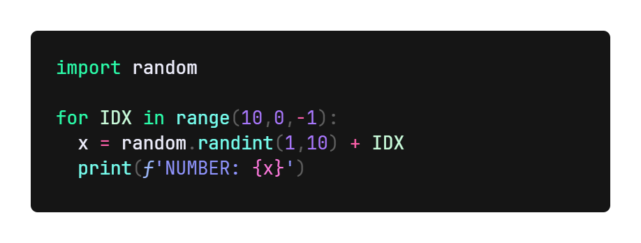

<style>
.faded { color:#80808090 }

.red { color:#FF806A }
.orange { color:#FF9025 }
.yellow { color:#FFDE65 }
.olive { color:#D2FF8A }
.green { color:#8AFFB5 }
.cyan { color:#77FFEF }
.blue { color:#8085FF }
.pink { color:#FF80CC }

.rose { color:#FF4D9A }
.hot-pink { color:#FF65CC }
.helitrope { color:#E565FF }
.mint { color:#9AFFB0 }
.neon-green { color:#2BFFAB }
.cyan-- { color:#55FFEF }
.blue-- { color:#7075FF }
.pink-- { color:#FC61EF }
</style>

# <b class='blue--'>XulbuX</b> <span class='cyan--'>Neon</span> <span class='neon-green'>Pro</span>

## A THEME WHICH FOCUSES ON <span class='pink'>CLEAR & BEAUTIFUL COLORS</span>

This VisualStudioCode extension contains two themes, which both try to make VSCode look good and do very clear syntax highlighting.

> To get a better feeling of how the themes look on the code, continue at the THEME PREVIEWS.

**Apply one of the themes:**

* Open the command input: `Cmd+Shift+K` on macOS or `Ctrl+Shift+K` on Windows and Linux or `F1` in general
* Enter «*color theme*» in the input field and click on `Preferences: Color Theme`.
* Search for the themes `XulbuX Neon` or `XulbuX Neon Pro` and select one of them by clicking on it.

<br>

# COLORS

*<span class='faded'>If you can't see the colored text, it's likely because VisualStudioCode doesn't show the colors.</span>*<br>
*<span class='faded'>In this case, just look at the example code-snippets to see how the themes look.</span>*

|                XulbuX Neon                 |          XulbuX Neon Pro           |
|                   :--:                     |               :--:                 |
|       <span class='rose'>rose</span>       |    <span class='red'>red</span>    |
|   <span class='hot-pink'>hot-pink</span>   | <span class='orange'>orange</span> |
|  <span class='helitrope'>helitrope</span>  | <span class='yellow'>yellow</span> |
|       <span class='mint'>mint</span>       |  <span class='olive'>olive</span>  |
| <span class='neon-green'>neon-green</span> |  <span class='green'>green</span>  |
|      <span class='cyan--'>cyan</span>      |   <span class='cyan'>cyan</span>   |
|      <span class='blue--'>blue</span>      |   <span class='blue'>blue</span>   |
|      <span class='pink--'>pink</span>      |   <span class='pink'>pink</span>   |

<br>

# THEME PREVIEWS

### <b class='blue'>XulbuX Neon:</b>

> **PYTHON**

</img><br>

> **JAVA**

</img><br>

> **C++**

</img><br><br>


### <b class='blue'>XulbuX Neon Pro:</b>

> **PYTHON**

</img><br>

> **JAVA**

</img><br>

> **C++**

</img><br>

<br>
<br>

___
# <b class='orange'>Enjoy!</b>

<br>

## <span class='blue'>Code Used for Color Previews</span>

**PYTHON**
```python
import random

for IDX in range(10,0,-1):
  x = random.randint(1,10) + IDX
  print(f'NUMBER: {x}')
```

**JAVA**

```java
package preview.code;
public class ex {
    public static void main(String [] args) {
      int k;
      for (k=10; k>=1; k--) {
        System.out.println(k);
      }
    }
}
```

**C++**

```cpp
using namespace std;
#include <iostream>
main() {
  int k;
  for (k=10; k>=1; k--) {
    cout << k << endl;
  }
}
```